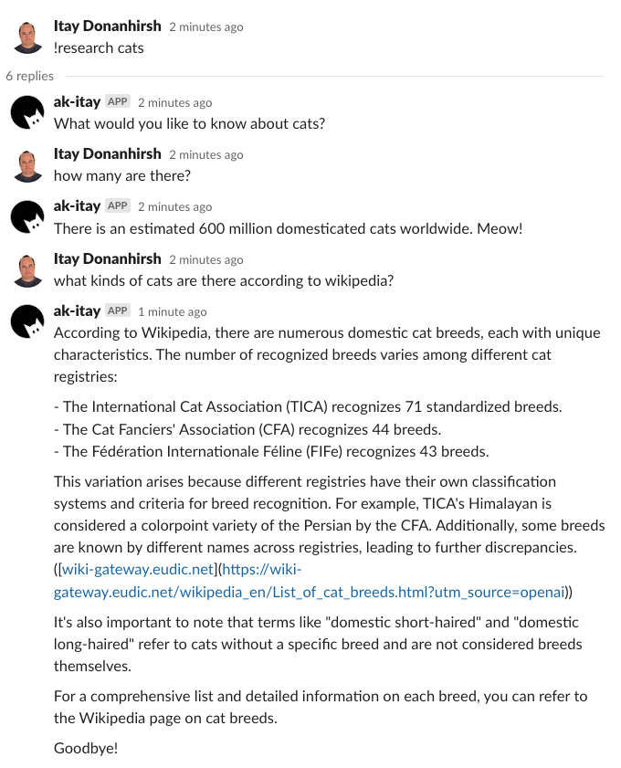

# Chat with Agents

This project demonstrates integration with OpenAI Agents SDK for durable Q&A session via Slack.
This also keeps track of the discussion, so each Q&A can relate to each other.

API documentation:

- [Python client SDK](https://openai.github.io/openai-agents-python/)

## Cloud Usage

1. Set the project variable OPENAI_API_KEY.
2. Initialize the Slack connection.
3. Deploy project.

### Trigger Workflow

1. Add the AutoKitteh Slack bot into a channel.
2. Type `!research cats`.
3. AutoKitteh will start a thread and you can run some Q&A with it.

## Local Usage

1. Set the OPENAI_API_KEY environment variable.
2. `python main.py`
