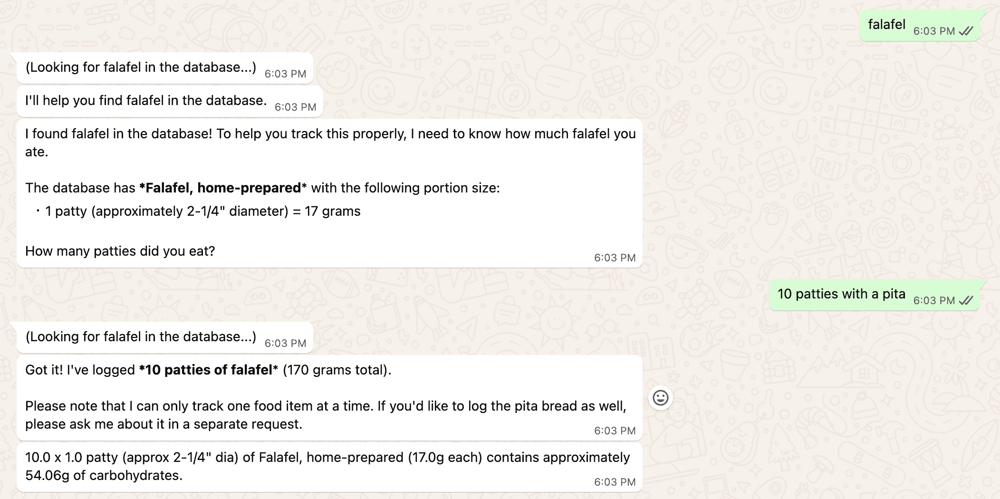

# CarbCat 🐱

[](https://app.autokitteh.cloud/template?name=gocat)

An AI-powered WhatsApp chatbot that helps users track carbohydrate content in their food. Simply message the bot with what you're eating, and it will tell you how many carbs are in your meal using the comprehensive USDA food database.



> **⚠️ Important Disclaimer**: This tool is intended for informational and educational purposes only. Do not rely solely on CarbCat for medical decisions, dietary management, or health-related calculations. Always consult with healthcare professionals, registered dietitians, or certified diabetes educators for personalized nutritional advice and medical guidance.

## Features

- **WhatsApp Interface**: Natural conversation through WhatsApp via Twilio
- **AI-Powered**: Uses Claude with tool use capabilities to understand food descriptions
- **Comprehensive Database**: Built on USDA FoodData Central SR Legacy dataset with thousands of foods
- **Smart Matching**: Fuzzy search algorithm to find foods even with approximate names
- **Portion Awareness**: Calculates carbs based on specific portions and amounts
- **Multi-Turn Conversations**: Clarifies ambiguous foods through follow-up questions

## How It Works

1. Send a message to the WhatsApp bot describing what you're eating
   - Example: "2 slices of whole wheat bread"
2. The AI analyzes your message and searches the food database
3. If needed, it asks clarifying questions about portion sizes or specific foods
4. Receive the total carbohydrate content instantly

## Architecture

```
WhatsApp (User) → Twilio → AutoKitteh → CarbCat Bot
                                          ├─ AI Engine (Claude)
                                          ├─ Food Database (USDA SR Legacy)
                                          └─ Session Management
```

### Key Components

- **`handlers.py`**: WhatsApp webhook handler and event processing
- **`ai.py`**: AI interaction engine using Claude's tool use API
- **`data.py`**: Food database loader and fuzzy search logic
- **`autokitteh.yaml`**: AutoKitteh project configuration

## Data Source

The food database is sourced from:

- **URL**: https://fdc.nal.usda.gov/download-datasets
- **Dataset**: SR Legacy
- **Content**: ~8,000 foods with detailed carbohydrate and portion information

## Setup

### Prerequisites

- Twilio account with WhatsApp sandbox or production number
- Anthropic API key (for Claude)

### Installation

1. Start using AutoKitteh Cloud: [](https://app.autokitteh.cloud/template?name=gocat)

2. Initialize your connections in the AutoKitteh UI:

   - Navigate to your deployed project
   - Go to the "Connections" tab
   - Initialize the `twilio` connection with your Twilio Account SID and Auth Token
   - Initialize the `anthropic` connection with your Anthropic API key

3. Set up Twilio WhatsApp:

   - Navigate to [Twilio Console](https://console.twilio.com/) → **Messaging** → **Try it out** → **Send a WhatsApp message**
   - Follow the instructions to join the WhatsApp sandbox (send a code to the Twilio number via WhatsApp)
   - Note the Twilio WhatsApp number (e.g., `+14155238886`)

4. Configure the webhook in Twilio:

   - In AutoKitteh, go to your project's **Triggers** tab
   - Copy the `whatsapp_message` webhook URL (see [instructions here](https://docs.autokitteh.com/get_started/deployment#webhook-urls))
   - In Twilio Console, navigate to **Messaging** → **Settings** → **WhatsApp sandbox settings**
   - Paste the webhook URL in the **"When a message comes in"** field
   - Save the configuration

5. Update `autokitteh.yaml` if using a custom WhatsApp number (optional):

   ```yaml
   variables:
     TWILIO_PHONE_NUMBER: "+14155238886" # Your Twilio WhatsApp number
   ```

6. Test the bot by sending a message via WhatsApp to your Twilio number

## Usage

### Basic Commands

- Send any food description to track carbs

### Example Conversations

**Simple Query:**

```
User: apple
Bot: One medium apple (182g) contains 25.1g of carbohydrates.
```

**Portion Clarification:**

```
User: rice
Bot: How much rice? (e.g., 1 cup, 100g, 1 serving)
User: 1 cup cooked
Bot: One cup of cooked white rice (158g) contains 44.5g of carbohydrates.
```

## Development

Run checks locally:

```bash
make
```

Deploying from the command line is convenient when deploying locally:

1. **Install the CLI**: https://docs.autokitteh.com/get_started/install
2. **Authenticate**: `ak auth login`
3. **Update configuration**: Edit `autokitteh.yaml` with your `GOOGLE_SPREADSHEET_ID`
4. **Deploy**: `make deploy`
5. **Initialize connection**: Log in to https://autokitteh.cloud and initialize the Google Sheets connection

After deployment, you'll receive a webhook URL that you can use to access your shortened URLs.
