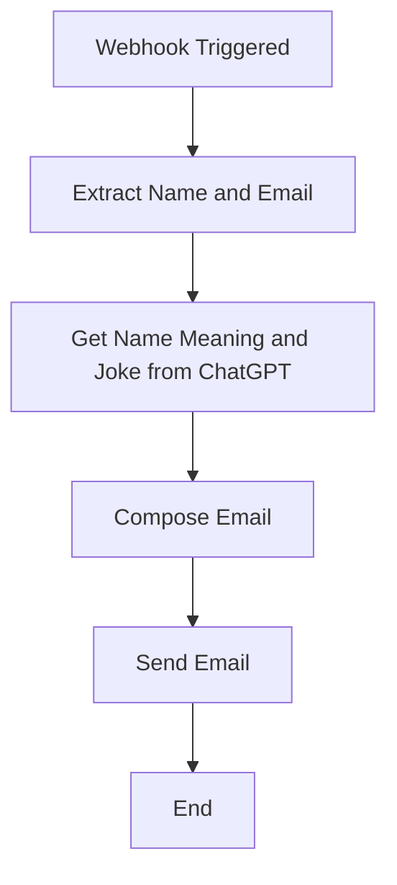

# Name Joke Emailer

This AutoKitteh project processes incoming webhook data containing a person's name and email address. When triggered, it:

1. Extracts the name and email from the JSON payload
2. Uses ChatGPT to retrieve the meaning of the name and generate a funny joke related to it
3. Composes an email containing the name, its meaning, and the joke
4. Sends the email to the address provided in the webhook payload

## Configuration

### Prerequisites

Before deploying this project, you need to:

1. Set up a ChatGPT connection in AutoKitteh
2. Set up a Gmail connection in AutoKitteh
3. Configure the `SENDER_EMAIL` environment variable in the project settings

### Environment Variables

- `SENDER_EMAIL`: The email address that will be used as the sender for outgoing emails

### Webhook Format

The webhook endpoint expects a JSON payload with the following structure:

```json
{
  "name": "John Doe",
  "email": "john.doe@example.com"
}
```

## Flow Diagram



## Usage

1. Deploy the project to AutoKitteh
2. Configure the connections and environment variables
3. Send a POST request to the webhook URL with the required JSON payload
4. The recipient will receive an email with their name meaning and a personalized joke

