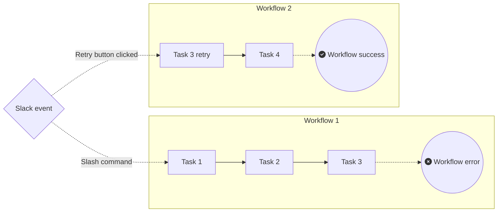

# Task Chain

This project demonstrates running a sequence of tasks, in several ways.

- Single-workflow approach:
  - A single workflow runs all the tasks, including retry loops; it handles
    Slack interactions using runtime event subscriptions
  - ["Basic" mode](./single_workflow/basic/) - ...
  - ["Advanced" mode](./single_workflow/advanced/) - ...
- [Event-driven approach](./event_driven/)
  - A single workflow runs all the tasks, except retries

