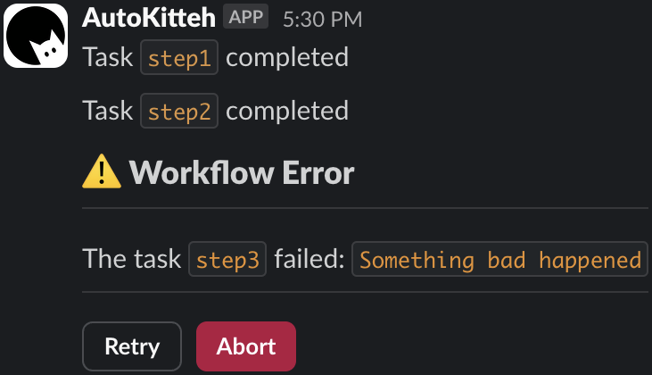
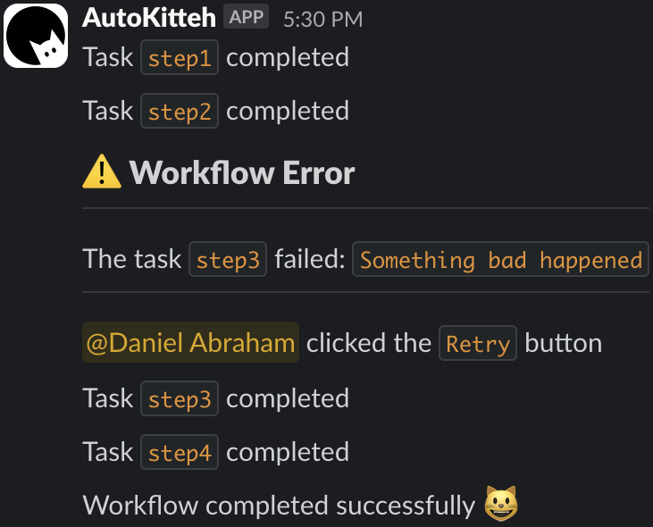
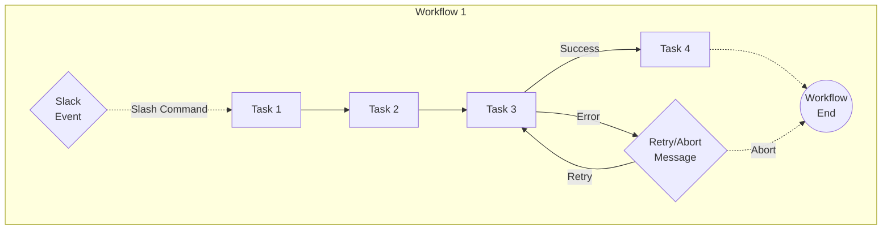
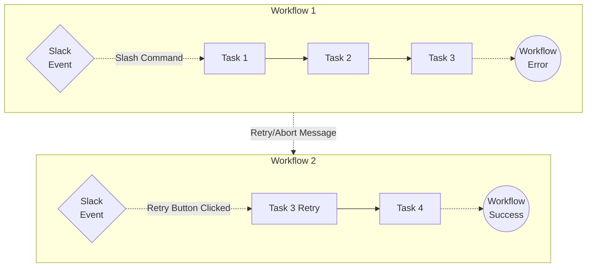

# Task Chain

This project runs a sequence of tasks with fault tolerance.

The workflow is resilient to errors in each step (with the ability to retry
each failing step on-demand via Slack), as well as server-side failures
(thanks to AutoKitteh's durable execution).

This directory contains three variants of this project:

1. **Single-workflow approach**: a single workflow runs all the tasks,
   including retry loops; it handles Slack interactions using runtime event
   subscriptions

   1. ["Basic" mode](./single_workflow/basic/) - an explicit specification of
      the transitions between steps, and each step is retried in its own loop

   2. ["Advanced" mode](./single_workflow/advanced/) - a single loop iterates
      over a global list of all the steps, and handles all the retries

2. **[Event-driven approach](./event_driven/)**: a single workflow runs
   multiple tasks, except for retries, which branch into separate workflows

