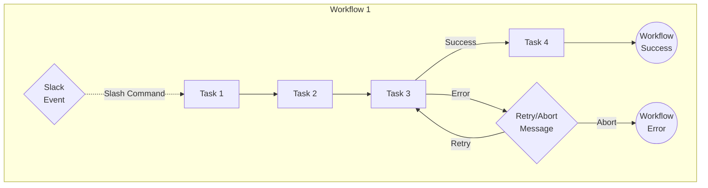

# Task Chain

This project demonstrates running a sequence of tasks, in three ways.

1. **Single-workflow approach**: a single workflow runs all the tasks,
   including retry loops; it handles Slack interactions using runtime event
   subscriptions

   1. ["Basic" mode](./single_workflow/basic/) - an explicit specification of
      the transition between steps, and each step is retried in its own loop

   2. ["Advanced" mode](./single_workflow/advanced/) - a single loop iterating
      over a global list of all the steps, and handling all retries

2. **[Event-driven approach](./event_driven/)**: a single workflow runs
   multiple tasks, except for retries, which branch into separate workflows

